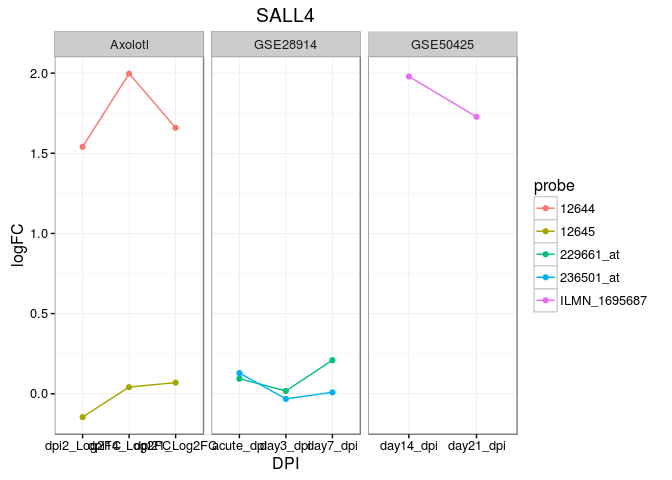
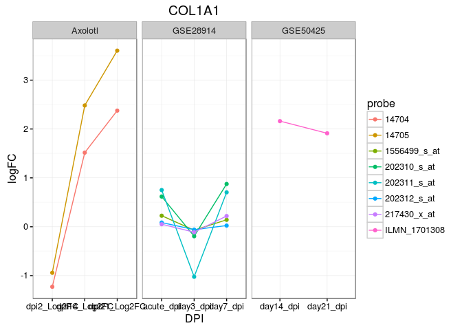

Differential Expression with Axolotl Custom Microarrays
=======================================================

### Download software

This only has to be done once on your computer.

``` r
source("http://bioconductor.org/biocLite.R")
biocLite("affy")  #tools to work with affy data
biocLite("makecdfenv") #required for custom cdf file
biocLite("limma") # GLM based analysis of Microarray data
biocLite("pheatmap")
```

``` r
library("affy")
library("makecdfenv")
library("limma")
library("pheatmap")

ts<-format(Sys.time(), "%a_%b_%d_%Y_%H%M")
cbPalette <- c("#999999", "#E69F00", "#56B4E9", "#009E73", "#F0E442", "#0072B2", "#D55E00", "#CC79A7")
```

### Load the CDF file

``` r
AMBY_002a520748F <- make.cdf.env("AMBY_002a520748F.cdf")
```

### Read all the Cel files in a directory

``` r
celfile.path="/mnt/gcd/axolotl/cel"
abatch = ReadAffy(filenames=list.celfiles(celfile.path),celfile.path=celfile.path,compress=TRUE)
```

### Process the Data

We will use a function called rma() to do a background correction and normalization. The expression values are returned on a log2 scale and stored in a "container" called an Expression Set.

``` r
eset = rma(abatch)
```

    ## Background correcting
    ## Normalizing
    ## Calculating Expression

### Extract Raw values

Use the function exprs() to extract the actually expression values from the Expression Set.

``` r
ex <- exprs(eset)
```

### Log Check

We want to make sure the data are log transformed. If we change the normalization method above to quantiles or decide not to do any normalization we still need to make sure the data is on a log2 scale. This section does nothing if you use rma() normalization above.

``` r
#calculate quantile values 
(qx <- as.numeric(quantile(ex, c(0., 0.25, 0.5, 0.75, 0.99, 1.0), na.rm=T)))
```

    ## [1]  2.249323  4.078063  5.581711  7.706421 13.020894 14.578911

``` r
#LogC will be TRUE if the data is not transformed
LogC <- (qx[5] > 100) ||
          (qx[6]-qx[1] > 50 && qx[2] > 0) ||
          (qx[2] > 0 && qx[2] < 1 && qx[4] > 1 && qx[4] < 2)

#Apply Log2 transform if LogC is TRUE
if (LogC) { 
  ex[which(ex <= 0)] <- NaN
  exprs(eset) <- log2(ex) 
  }
```

### Look at a few transcripts to see their values in each sample

``` r
#Sanity Check - Col11a1 & Prod1
ex[c("axo00376-f_at","axo24047-f_at"),]
```

    ##               KE_10_(AMBY_002a520748F).CEL.gz
    ## axo00376-f_at                         5.74934
    ## axo24047-f_at                        11.16067
    ##               KE_11_(AMBY_002a520748F).CEL.gz
    ## axo00376-f_at                        9.372172
    ## axo24047-f_at                        7.850118
    ##               KE_12_(AMBY_002a520748F).CEL.gz
    ## axo00376-f_at                        9.705102
    ## axo24047-f_at                        7.195792
    ##               KE_1_(AMBY_002a520748F).CEL.gz
    ## axo00376-f_at                       4.228243
    ## axo24047-f_at                       4.765848
    ##               KE_2_(AMBY_002a520748F).CEL.gz
    ## axo00376-f_at                       5.467693
    ## axo24047-f_at                      12.307688
    ##               KE_3_(AMBY_002a520748F).CEL.gz
    ## axo00376-f_at                       8.422779
    ## axo24047-f_at                       9.858557
    ##               KE_4_(AMBY_002a520748F).CEL.gz
    ## axo00376-f_at                       9.660200
    ## axo24047-f_at                       7.719317
    ##               KE_5_(AMBY_002a520748F).CEL.gz
    ## axo00376-f_at                       4.565211
    ## axo24047-f_at                       5.284454
    ##               KE_6_(AMBY_002a520748F).CEL.gz
    ## axo00376-f_at                       5.202006
    ## axo24047-f_at                      12.830248
    ##               KE_7_(AMBY_002a520748F).CEL.gz
    ## axo00376-f_at                       8.735817
    ## axo24047-f_at                      10.171669
    ##               KE_8_(AMBY_002a520748F).CEL.gz
    ## axo00376-f_at                       9.612157
    ## axo24047-f_at                       7.528019
    ##               KE_9_(AMBY_002a520748F).CEL.gz
    ## axo00376-f_at                       3.846667
    ## axo24047-f_at                       5.365890

### Assign groups to each of the samples.

Now assign a group name to each sample. It can be any word, but avoid starting with a number. This is the trickiest part because you want to make sure the right file name gets put in the right group.

``` r
#First list the sample names.
sampleNames(eset)
```

    ##  [1] "KE_10_(AMBY_002a520748F).CEL.gz" "KE_11_(AMBY_002a520748F).CEL.gz"
    ##  [3] "KE_12_(AMBY_002a520748F).CEL.gz" "KE_1_(AMBY_002a520748F).CEL.gz" 
    ##  [5] "KE_2_(AMBY_002a520748F).CEL.gz"  "KE_3_(AMBY_002a520748F).CEL.gz" 
    ##  [7] "KE_4_(AMBY_002a520748F).CEL.gz"  "KE_5_(AMBY_002a520748F).CEL.gz" 
    ##  [9] "KE_6_(AMBY_002a520748F).CEL.gz"  "KE_7_(AMBY_002a520748F).CEL.gz" 
    ## [11] "KE_8_(AMBY_002a520748F).CEL.gz"  "KE_9_(AMBY_002a520748F).CEL.gz"

Brute force way. Assign each one manually:

``` r
groups<-character() #create a variable called groups

groups[1]<-"dpi2"
groups[2]<-"dpi14"
groups[3]<-"dpi21"
groups[4]<-"uninjured"
groups[5]<-"dpi2"
groups[6]<-"dpi14"
groups[7]<-"dpi21"
groups[8]<-"uninjured"
groups[9]<-"dpi2"
groups[10]<-"dpi14"
groups[11]<-"dpi21"
groups[12]<-"uninjured"

#convert to a factor
groups<-as.factor(groups)

#Create a Named table to make sure the correct files are associated with the correct groups
names(groups)<-sampleNames(eset)
groups
```

    ## KE_10_(AMBY_002a520748F).CEL.gz KE_11_(AMBY_002a520748F).CEL.gz 
    ##                            dpi2                           dpi14 
    ## KE_12_(AMBY_002a520748F).CEL.gz  KE_1_(AMBY_002a520748F).CEL.gz 
    ##                           dpi21                       uninjured 
    ##  KE_2_(AMBY_002a520748F).CEL.gz  KE_3_(AMBY_002a520748F).CEL.gz 
    ##                            dpi2                           dpi14 
    ##  KE_4_(AMBY_002a520748F).CEL.gz  KE_5_(AMBY_002a520748F).CEL.gz 
    ##                           dpi21                       uninjured 
    ##  KE_6_(AMBY_002a520748F).CEL.gz  KE_7_(AMBY_002a520748F).CEL.gz 
    ##                            dpi2                           dpi14 
    ##  KE_8_(AMBY_002a520748F).CEL.gz  KE_9_(AMBY_002a520748F).CEL.gz 
    ##                           dpi21                       uninjured 
    ## Levels: dpi14 dpi2 dpi21 uninjured

Alternative, we can use the rep() function to repeat the group names 3 times.

``` r
#this is the same length as the number of samples
groups2<-as.factor(rep(c("dpi2","dpi14","dpi21","uninjured"),3))
names(groups2)<-sampleNames(eset)
groups2
```

Now we have to tell limma what the different groups are. This is called a design matrix. Limma multiplies all expression data by this matrix to get values for each group. This section creates this matrix and you just have to look at it to make sure that all the 1's are in the column corresponding to the right sample name and group name.

``` r
eset$description <- groups
design <- model.matrix(~ description + 0, eset)
colnames(design) <- levels(groups)
design
```

    ##                                 dpi14 dpi2 dpi21 uninjured
    ## KE_10_(AMBY_002a520748F).CEL.gz     0    1     0         0
    ## KE_11_(AMBY_002a520748F).CEL.gz     1    0     0         0
    ## KE_12_(AMBY_002a520748F).CEL.gz     0    0     1         0
    ## KE_1_(AMBY_002a520748F).CEL.gz      0    0     0         1
    ## KE_2_(AMBY_002a520748F).CEL.gz      0    1     0         0
    ## KE_3_(AMBY_002a520748F).CEL.gz      1    0     0         0
    ## KE_4_(AMBY_002a520748F).CEL.gz      0    0     1         0
    ## KE_5_(AMBY_002a520748F).CEL.gz      0    0     0         1
    ## KE_6_(AMBY_002a520748F).CEL.gz      0    1     0         0
    ## KE_7_(AMBY_002a520748F).CEL.gz      1    0     0         0
    ## KE_8_(AMBY_002a520748F).CEL.gz      0    0     1         0
    ## KE_9_(AMBY_002a520748F).CEL.gz      0    0     0         1
    ## attr(,"assign")
    ## [1] 1 1 1 1
    ## attr(,"contrasts")
    ## attr(,"contrasts")$description
    ## [1] "contr.treatment"

alternative design
==================

<https://support.bioconductor.org/p/40388/>

<https://support.bioconductor.org/p/44383/>

``` r
groups2<-as.factor(rep(c("dpi2","dpi14","dpi21","uninjured"),3))
names(groups2)<-sampleNames(eset)
groups2

time<-rep(c(2,14,21,0),3)
design <- model.matrix(~time)
```

### Limma

Now we just have to do the math. This step applies a linear model to find the best fit. It is the same idea as making a standard curve and fitting the data to a line (think a bradford assay or a dose response curve). Each gene has an expression value in each group and an error associated with it.

``` r
fit <- lmFit(eset, design)
```

Now we have a table of exression for every gene at every time point. The next thing to do would be a statististical test between any two timepoints. Each comparison is called a contrast.

``` r
contrasts <- makeContrasts(dpi2-uninjured,dpi14-uninjured,dpi21-uninjured, levels=design)
contrasts_dpi2 <- makeContrasts(dpi2-uninjured, levels=design)
contrasts_dpi14 <- makeContrasts(dpi14-uninjured, levels=design)
contrasts_dpi21 <- makeContrasts(dpi21-uninjured, levels=design)

#contrasts <- makeContrasts(dpi2-uninjured,dpi14-dpi2,dpi21-dpi14, levels=design)
fit2 <- contrasts.fit(fit, contrasts)
fit2_dpi2 <-contrasts.fit(fit,contrasts_dpi2)
fit2_dpi14 <-contrasts.fit(fit,contrasts_dpi14)
fit2_dpi21 <-contrasts.fit(fit,contrasts_dpi21)
```

Now do the math to calculate the statistic significance for each gene. We also use Bayes Rule to moderate the errors by telling the function that we expect approximately 1% of the genes to be differentially expressed.

``` r
fit2 <- eBayes(fit2, 0.01)
fit2_dpi2<-eBayes(fit2_dpi2,0.05)
fit2_dpi14<-eBayes(fit2_dpi14,0.05)
fit2_dpi21<-eBayes(fit2_dpi21,0.05)
```

### Output

The final step is to print out the useful information to a table. This is done with a function called topTable.

``` r
tT <- topTable(fit2, adjust="BH", sort.by="none", number=Inf)
tT_2dpi <- topTable(fit2_dpi2, adjust="BH", sort.by="none", number=Inf)
tT_14dpi <- topTable(fit2_dpi14, adjust="BH", sort.by="none", number=Inf)
tT_21dpi <- topTable(fit2_dpi21, adjust="BH", sort.by="none", number=Inf)

#add decide tests
tT$deg<-decideTests(fit2,lfc=0)
tT_2dpi$deg<-decideTests(fit2_dpi2,lfc=1)
tT_14dpi$deg<-decideTests(fit2_dpi14,lfc=1)
tT_21dpi$deg<-decideTests(fit2_dpi21,lfc=1)

#subset just the Axolotl Genes
tT<-tT[grep('axo',rownames(tT)),]
tT_2dpi<-tT_2dpi[grep('axo',rownames(tT)),]
tT_14dpi<-tT_14dpi[grep('axo',rownames(tT)),]
tT_21dpi<-tT_21dpi[grep('axo',rownames(tT)),]

colnames(tT)[1:3]<-c("dpi2_Log2FC","dpi14_Log2FC","dpi21_Log2FC")
```

Since the probe IDs aren't really useful, we'd like to also add the Annotation Data to our table. First read in the table and merge to the two tables using the probeID.

``` r
annotations<-read.csv("Amby002-Annotations-Final_win.csv",stringsAsFactors=F)
annotated_tT<-merge(tT,annotations,by.x=0,by.y=1)
annotated_tT_dpi2<-merge(tT_2dpi,annotations,by.x=0,by.y=1)
annotated_tT_dpi14<-merge(tT_14dpi,annotations,by.x=0,by.y=1)
annotated_tT_dpi21<-merge(tT_21dpi,annotations,by.x=0,by.y=1)
```

``` r
par(mfrow=c(1,3))
plot(annotated_tT_dpi2$logFC,-log10(annotated_tT_dpi2$adj.P.Val),
     xlim=c(-7,7),ylim=c(0,10), main="2dpi",
     col=abs(annotated_tT_dpi2$deg)+1,pch=16,cex=0.5)
plot(annotated_tT_dpi14$logFC,-log10(annotated_tT_dpi14$adj.P.Val),
     xlim=c(-7,7),ylim=c(0,10), main="14dpi",
     col=abs(annotated_tT_dpi14$deg)+1,pch=16,cex=0.5)
plot(annotated_tT_dpi21$logFC,-log10(annotated_tT_dpi21$adj.P.Val),
     xlim=c(-7,7),ylim=c(0,10), main="21dpi",
     col=abs(annotated_tT_dpi21$deg)+1,pch=16,cex=0.5)
```


Your done! Write out a table!
=============================

``` r
write.csv(annotated_tT,file="my_micrarray_data.csv",quote=F,row.names=F)
```

Heatmap
=======

``` r
load("human_data.rdata")
at<-annotated_tT
#at<-at[at$adj.P.Val <0.05 & (abs(at$dpi2_Log2FC) > 4 | abs(at$dpi14_Log2FC) > 4 | abs(at$dpi21_Log2FC) > 4),]
at<-at[at$adj.P.Val <0.05 & abs(at$dpi2_Log2FC) > 1,]
at<-at[!(at$Gene=="" | at$Gene =="#N/A"),]
at<-at[with(at,order(adj.P.Val)),]
at<-at[!duplicated(at$Gene),]
dim(at)
```

    ## [1] 569  13

``` r
temp<-humanGSE28914[humanGSE28914$symbol %in% at$Gene,]
dim(temp)
```

    ## [1] 1217    4

``` r
temp$abs<-abs(temp$day3_dpi)
temp<-temp[with(temp,order(-abs)),]
#only look at lowest pvalue for duplicated genes
dim(at)
```

    ## [1] 569  13

``` r
at[grep("SALL4",at$Gene),]
```

    ##           Row.names dpi2_Log2FC dpi14_Log2FC dpi21_Log2FC  AveExpr
    ## 12644 axo17557-f_at    1.540295     1.996916     1.659055 5.495529
    ##              F      P.Value  adj.P.Val deg.dpi2 - uninjured
    ## 12644 16.53686 0.0002767566 0.00502012                    1
    ##       deg.dpi14 - uninjured deg.dpi21 - uninjured Probe.Set.ID.1
    ## 12644                     1                     1     axo17557-f
    ##              Name  Gene                 Source.Seq
    ## 12644 contig82542 SALL4  sal-like 4 [Homo sapiens]

``` r
results<-pheatmap(at[,2:4],labels_row=at$Gene,cluster_cols=F)
```



``` r
temp<-temp[!duplicated(temp$symbol),]
dim(temp)
```

    ## [1] 538   5

``` r
temp2<-merge(at,temp,by.x="Gene",by.y="symbol")
dim(temp2)
```

    ## [1] 538  17

``` r
temp2<-temp2[temp2$abs<0.1,]
temp2[grep("SALL4",temp2$Gene),]
```

    ##      Gene     Row.names dpi2_Log2FC dpi14_Log2FC dpi21_Log2FC  AveExpr
    ## 408 SALL4 axo17557-f_at    1.540295     1.996916     1.659055 5.495529
    ##            F      P.Value  adj.P.Val deg.dpi2 - uninjured
    ## 408 16.53686 0.0002767566 0.00502012                    1
    ##     deg.dpi14 - uninjured deg.dpi21 - uninjured Probe.Set.ID.1        Name
    ## 408                     1                     1     axo17557-f contig82542
    ##                     Source.Seq acute_dpi    day3_dpi    day7_dpi
    ## 408  sal-like 4 [Homo sapiens] 0.1292191 -0.03227266 0.008757545
    ##            abs
    ## 408 0.03227266

``` r
# Figure X
results<-pheatmap(temp2[,c(3:5)],labels_row=temp2$Gene,cluster_cols=F)
```



``` r
results
```

    ## $tree_row
    ## 
    ## Call:
    ## hclust(d = d, method = method)
    ## 
    ## Cluster method   : complete 
    ## Distance         : euclidean 
    ## Number of objects: 57 
    ## 
    ## 
    ## $tree_col
    ## [1] NA
    ## 
    ## $kmeans
    ## [1] NA
    ## 
    ## $gtable
    ## TableGrob (5 x 6) "layout": 5 grobs
    ##   z     cells      name                       grob
    ## 1 1 (4-4,1-1)  row_tree polyline[GRID.polyline.17]
    ## 2 2 (4-4,3-3)    matrix       gTree[GRID.gTree.19]
    ## 3 3 (5-5,3-3) col_names         text[GRID.text.20]
    ## 4 4 (4-4,4-4) row_names         text[GRID.text.21]
    ## 5 5 (3-5,5-5)    legend       gTree[GRID.gTree.24]

``` r
annotated_tT[grep("SALL4",annotated_tT$Gene),]
```

    ##           Row.names dpi2_Log2FC dpi14_Log2FC dpi21_Log2FC  AveExpr
    ## 12644 axo17557-f_at   1.5402952   1.99691587   1.65905545 5.495529
    ## 12645 axo17558-f_at  -0.1456877   0.04154637   0.06935809 4.366970
    ##               F      P.Value  adj.P.Val deg.dpi2 - uninjured
    ## 12644 16.536864 0.0002767566 0.00502012                    1
    ## 12645  1.184508 0.3624626751 0.54247347                    0
    ##       deg.dpi14 - uninjured deg.dpi21 - uninjured Probe.Set.ID.1
    ## 12644                     1                     1     axo17557-f
    ## 12645                     0                     0     axo17558-f
    ##              Name  Gene                 Source.Seq
    ## 12644 contig82542 SALL4  sal-like 4 [Homo sapiens]
    ## 12645 contig91317 SALL4  sal-like 4 [Homo sapiens]
